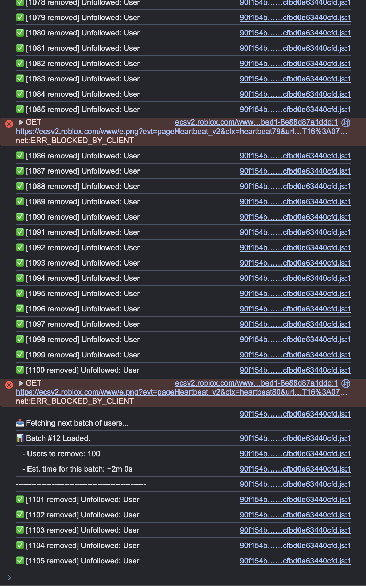

# Roblox Mass Unfolower Console Script

A JavaScript console script to automatically unfollow everyone on Roblox. 
It handles CSRF token refreshing, rate limiting, and batch processing automatically.

## ⚠️ Disclaimer
Use at your own risk. Roblox has strict anti-botting measures. This script includes safety delays (1.5s per action) to avoid rate limits, but **do not edit the speed** unless you know what you are doing.

## How to Use (Browser Console Method)

1. Go to your [Roblox Profile](https://www.roblox.com).
2. Right-click anywhere and select **Inspect** (or press F12).
3. Go to the **Console** tab.
4. **IMPORTANT:** If you see a warning about pasting code, type `allow pasting` and hit Enter.
5. Copy the code from `roblox-unfollower.js` in this repository.
6. Paste it into the console and hit Enter.
7. Leave the tab open while it runs.

## Features
- **Auto-Token Refresh:** Automatically fixes 403 Forbidden errors when your security token expires.
- **Rate Limit Protection:** Pauses automatically if Roblox sends a 429 (Too Many Requests) error.
- **Dashboard:** Shows live progress, estimated time remaining, and total count.

